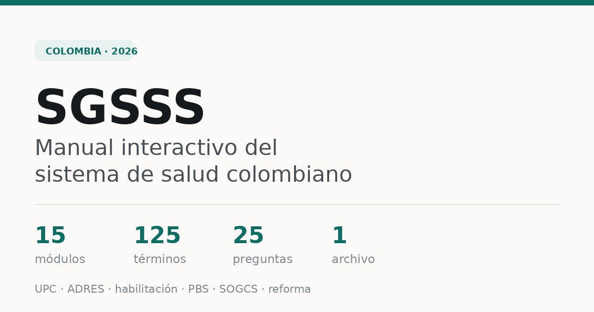

# SGSSS · Manual interactivo del sistema de salud colombiano

Herramienta de estudio y consulta rápida sobre el **Sistema General de Seguridad Social en Salud (SGSSS)** de Colombia. Todo el sistema explicado en una sola página: desde la Ley 100 de 1993 hasta el estado de la reforma en julio de 2026.

**→ [Abrir el manual](https://jdsr-debug.github.io/sgsss-manual/)**

**→ [Abrir la calculadora de Tasa de Filtración Glomerular (TFG)](https://jdsr-debug.github.io/sgsss-manual/tfg.html)**



---

## Qué contiene

**15 módulos** ordenados por lógica causal, no alfabética. Empieza por el flujo del dinero, porque es lo que explica por qué existe cada actor del sistema.

| # | Módulo | Cubre |
|---|--------|-------|
| 00 | Panorama | La cadena completa del sistema en un diagrama |
| 01 | Línea de tiempo normativa | De la Constitución de 1991 al Decreto 858 de 2025 |
| 02 | Principios | Ley 100 art. 2 vs. Ley Estatutaria 1751 art. 6 |
| 03 | Mapa de actores | Dirección, financiación, aseguramiento, prestación, control |
| 04 | Regímenes y afiliación | Contributivo, subsidiado, exceptuados, cotización |
| 05 | Flujo del dinero | Fuentes, compensación, giro directo, modalidades de pago |
| 06 | UPC y presupuestos máximos | Cálculo, ajustes de riesgo, valores 2026 |
| 07 | PBS, exclusiones y MIPRES | Lógica de lista negativa tras la Ley Estatutaria |
| 08 | Prestación y redes | Niveles de complejidad, RIPSS, referencia, glosas |
| 09 | SOGCS | Los cuatro componentes de la calidad |
| 10 | Sistema Único de Habilitación | Res. 3100 de 2019 y los 7 estándares |
| 11 | Inspección, vigilancia y control | Supersalud y su función jurisdiccional |
| 12 | Salud pública y APS | PDSP, PIC, RIAS, CAPS y Equipos Básicos de Salud |
| 13 | Riesgos laborales (SGRL) | Diferencias prácticas frente al SGSSS |
| 14 | Reforma 2023–2026 | Cronología, contenido y el debate en sus dos versiones |

Más una sección de **cifras clave 2026**, un **glosario de 125 términos** y una **autoevaluación de 25 preguntas** con explicación razonada.

## Cómo se usa

- **Buscador global** — tecla `/` o clic en la barra superior. Indexa todo el contenido y salta al párrafo exacto, resaltándolo.
- **Siglas explicadas en contexto** — toda sigla del texto aparece subrayada con puntos. Pasa el cursor (o tócala en móvil) para ver su definición sin salir de donde vas leyendo.
- **Siglario flotante** — botón inferior derecho. Abre un panel filtrable con las 125 entradas, sin mover tu posición de lectura.
- **Modo claro y oscuro** — botón `◐` en la barra superior.
- **Autoevaluación** — 25 preguntas con retroalimentación inmediata.

## Detalles técnicos

Un solo archivo HTML sin dependencias: sin frameworks, sin CDN, sin analítica, sin cookies. Funciona **completamente offline** — puedes descargarlo y abrirlo con doble clic en cualquier navegador.

```
index.html      # el manual completo (~125 KB)
tfg.html        # calculadora de Tasa de Filtración Glomerular (TFG)
preview.png     # imagen para vista previa al compartir el enlace
```

## Fuentes y vigencia

Construido sobre la Ley 100 de 1993 y su desarrollo, la Ley Estatutaria 1751 de 2015, el Decreto 780 de 2016, la Resolución 3100 de 2019 y normas concordantes.

Las cifras de 2026 y el estado del trámite legislativo fueron verificados en julio de 2026:

- **UPC 2026** — Resolución 2764 de 2025: $1.658.912,01 (contributivo) y $1.541.706,27 (subsidiado)
- **SMLMV 2026** — Decreto 1469 de 2025: $1.750.905
- **UVB 2026** — $12.110; copagos y cuotas moderadoras según Circular Externa 048 de 2025
- **Reforma** — archivada en Comisión Séptima del Senado en diciembre de 2025; nuevo proyecto de 90 artículos radicado el 21 de julio de 2026
- **Modelo de atención** — Decreto 858 de 2025 (CAPS y Equipos Básicos de Salud)
- **Giro directo de presupuestos máximos** — Resolución 0107427 de 2026 de la ADRES

> [!IMPORTANT]
> Este material es una herramienta de estudio y consulta rápida. La reglamentación del sector salud cambia con frecuencia: **antes de usar una cifra o una norma en un documento con efectos jurídicos o clínicos, confírmala en la fuente oficial.** No sustituye asesoría jurídica ni criterio profesional.

## Licencia

[CC BY 4.0](LICENSE) — puedes compartirlo y adaptarlo libremente, incluso con fines comerciales, dando crédito.
